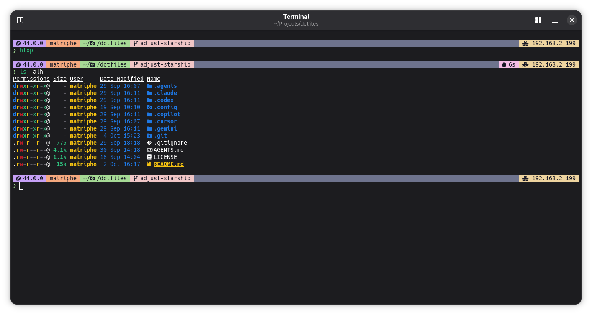

# dotfiles

Personal Zsh, terminal, application, and AI-agent configuration.

Follow the steps below to install the tools, check out this repository as a bare
Git repository in `$HOME`, and configure Zsh to use the files.



## Table of contents

- [Install Zsh and required tools](#install-zsh-and-required-tools)
- [Install optional components](#install-optional-components)
  - [Install Antidote](#install-antidote)
  - [Install Starship](#install-starship)
  - [Install a Nerd Font](#install-a-nerd-font)
  - [Install Podman or Docker](#install-podman-or-docker)
- [Clone this repository](#clone-this-repository)
- [Configure Zsh](#configure-zsh)
- [Start and manage your shell](#start-and-manage-your-shell)
  - [Manage Zsh plugins](#manage-zsh-plugins)
- [Zsh modules](#zsh-modules)
- [AI agent configuration](#ai-agent-configuration)
- [Component documentation](#component-documentation)
- [Credits](#credits)
- [License](#license)

## Install Zsh and required tools

Install Zsh and the command-line tools for your operating system.

| Tool | Purpose |
| --- | --- |
| [Git](https://git-scm.com/) | Clone and manage this repository as a bare repository. |
| [curl](https://curl.se/) | Download installation files and release assets. |
| [Zsh](https://www.zsh.org/) | Run the configured shell. |
| [Tmux](https://github.com/tmux/tmux) | Run the configured terminal multiplexer. |
| [Eza](https://github.com/eza-community/eza) | Provide the `ls`, `ll`, `la`, and `tree` aliases, using the Catppuccin Macchiato palette shared with Starship and tmux. |
| [Bat](https://github.com/sharkdp/bat) | Provide syntax highlighting through the `cat` alias. |
| [Ripgrep](https://github.com/BurntSushi/ripgrep) | Search files while keeping `grep` available with its own flags. |
| [Lf](https://github.com/gokcehan/lf) | Browse files with the `lf` navigation function. |

### Fedora

Install the tools with DNF. Enable the COPR repository to install `lf`, which
is not in Fedora's standard repositories:

```sh
sudo dnf install -y zsh git curl tmux eza bat ripgrep
sudo dnf copr enable -y pennbauman/ports
sudo dnf install -y lf
```

### Arch Linux

Install the tools with Pacman:

```sh
sudo pacman -Syu --needed --noconfirm zsh git curl tmux eza bat ripgrep lf fontconfig
```

### Debian, Ubuntu, and Linux Mint

Linux Mint uses Ubuntu as its package base; Linux Mint Debian Edition (LMDE)
uses Debian. Install the tools with APT:

```sh
sudo apt install -y zsh git curl tmux eza bat ripgrep lf
```

If your release does not provide `eza`, follow the upstream instructions for
[Eza](https://github.com/eza-community/eza).

### macOS

Zsh is included with macOS. Install the other tools with Homebrew:

```sh
brew install git curl tmux eza bat ripgrep lf
```

## Install optional components

Install the components you want to use. Starship and a Nerd Font provide the
configured prompt; Antidote loads Zsh plugins. Install a container engine if
you use the Docker-compatible commands.

### Install Antidote

Install [Antidote](https://antidote.sh/) by cloning it into the directory
expected by this configuration:

```sh
mkdir -p "$HOME/.local/share/zsh"
git clone --depth=1 https://github.com/mattmc3/antidote.git \
  "$HOME/.local/share/zsh/antidote"
```

This follows Antidote's [official Git installation
method](https://antidote.sh/). On macOS, avoid installing Antidote with
Homebrew because upgrades can replace the Cellar path. On Arch Linux, the AUR
package installs the loader in a different path; use the Git installation
above.

The shared plugin list is in [`.config/zsh/.zsh_plugins.txt`](.config/zsh/.zsh_plugins.txt).
It includes:

- [Autosuggestions](https://github.com/zsh-users/zsh-autosuggestions) from command history.
- [Syntax highlighting](https://github.com/zsh-users/zsh-syntax-highlighting) for commands before they run.
- [History substring search](https://github.com/zsh-users/zsh-history-substring-search) using text entered at the prompt.
- [Additional completions](https://github.com/zsh-users/zsh-completions) for Zsh commands.
- The `git` and `alias-finder` plugins from [oh-my-zsh](https://github.com/ohmyzsh/ohmyzsh).

### Install Starship

Install [Starship](https://starship.rs/) using the instructions for your
operating system:

#### Arch Linux

```sh
sudo pacman -S --needed --noconfirm starship
```

See the [official Starship guide](https://starship.rs/guide/).

#### Fedora

```sh
sudo dnf copr enable -y atim/starship
sudo dnf install -y starship
```

#### Debian and Ubuntu

```sh
sudo apt install -y starship
```

#### Linux Mint

```sh
curl -sS https://starship.rs/install.sh | sh
```

#### macOS

```sh
brew install starship
```

### Install a Nerd Font

Install [Hack Nerd Font](https://github.com/ryanoasis/nerd-fonts) for the icons
and glyphs in the Starship prompt. You can use another Nerd Font, such as
JetBrainsMono Nerd Font, if you prefer.

#### Arch Linux

```sh
sudo pacman -S --needed --noconfirm ttf-hack-nerd
fc-list | grep -i 'Hack Nerd Font'
```

Select `Hack Nerd Font` in your terminal emulator.

#### Fedora

```sh
mkdir -p "$HOME/.local/share/fonts"
curl -L https://github.com/ryanoasis/nerd-fonts/releases/latest/download/Hack.tar.xz \
  | tar -xJ -C "$HOME/.local/share/fonts"
fc-cache -f
fc-list | grep -i 'Hack Nerd Font'
```

To use another font, replace `Hack.tar.xz` with the matching archive from the
[Nerd Fonts releases](https://github.com/ryanoasis/nerd-fonts/releases).

#### Debian, Ubuntu, and Linux Mint

Install Fontconfig, then download and register the font:

```sh
sudo apt install -y fontconfig
mkdir -p "$HOME/.local/share/fonts"
curl -L https://github.com/ryanoasis/nerd-fonts/releases/latest/download/Hack.tar.xz \
  | tar -xJ -C "$HOME/.local/share/fonts"
fc-cache -f -v "$HOME/.local/share/fonts"
fc-list | grep -i 'Hack Nerd Font'
```

If `fc-cache` is unavailable, open a new shell or run `hash -r`. Select
`Hack Nerd Font` in your terminal emulator. To use another font, replace
`Hack.tar.xz` with the matching archive from the [Nerd Fonts
releases](https://github.com/ryanoasis/nerd-fonts/releases).

#### macOS

```sh
brew install --cask font-hack-nerd-font
```

### Install Podman or Docker

Install a container engine before using the Docker-compatible aliases.

#### Arch Linux

Install Docker Engine and Compose, start the Docker service, and verify both
commands:

```sh
sudo pacman -S --needed --noconfirm docker docker-compose
sudo systemctl enable --now docker
sudo docker run hello-world
docker compose version
```

Use `sudo` for Docker commands unless you have configured another access
method. Adding a user to the `docker` group grants root-equivalent privileges;
see the [ArchWiki Docker documentation](https://wiki.archlinux.org/title/Docker).

#### Fedora

Use [Podman](https://podman.io/) as the container engine:

```sh
sudo dnf install -y podman podman-compose
```

Use [Podman Compose](https://github.com/containers/podman-compose) for
Compose-compatible commands. The Podman module maps `docker` to `podman` and
`docker-compose` to `podman-compose`.

#### Debian, Ubuntu, and Linux Mint

First configure Docker's official APT repository using the distribution
instructions in the [Docker Engine installation guide](https://docs.docker.com/engine/install/).
Then install Docker Engine and Compose, start Docker, and verify the commands:

```sh
sudo apt install -y docker-ce docker-ce-cli containerd.io docker-buildx-plugin docker-compose-plugin
sudo systemctl enable --now docker
sudo docker run hello-world
docker compose version
```

Install `docker-compose-plugin` for the `docker compose` command. Do not
install the legacy standalone `docker-compose` package.

#### macOS

Choose [Docker Desktop](https://www.docker.com/products/docker-desktop/) or
[Colima](https://github.com/abiosoft/colima).

With Docker Desktop, use its bundled `docker` and `docker-compose` commands
and enable the Docker CLI in its settings. The Podman module only overrides
these commands when both `podman` and `podman-compose` are installed.

With Colima, install the Docker CLI, Compose, and Colima, then start the
virtual machine:

```sh
brew install docker docker-compose colima
colima start
mkdir -p "$HOME/.docker/cli-plugins"
ln -sfn "$(brew --prefix)/opt/docker-compose/bin/docker-compose" \
  "$HOME/.docker/cli-plugins/docker-compose"
```

The symlink makes Homebrew's standalone `docker-compose` binary available to
the Docker CLI as `docker compose`.

## Clone this repository

Clone the repository as a bare Git repository and use your home directory as
its working tree:

```sh
cd "$HOME"
git clone --bare https://github.com/matriphe/dotfiles.git .dotfiles
git --git-dir="$HOME/.dotfiles" --work-tree="$HOME" config --local status.showUntrackedFiles no
git --git-dir="$HOME/.dotfiles" --work-tree="$HOME" checkout
```

Tracked files are placed directly in your home directory, including
`AGENTS.md`, `.config/zsh`, and `.config/tmux`. The bare repository is stored
separately at `~/.dotfiles`.

## Configure Zsh

Configure the global Zsh startup file to use `$HOME/.config/zsh`. The checked
out directory must exist before you add this configuration.

On Linux, the first Zsh launch may show the `zsh-newuser-install` menu because
no startup files exist yet. Select `q` when prompted:

```text
(q) Quit and do nothing. The function will be run again next time.
```

This avoids creating a generated Zsh configuration. See the [official Zsh
documentation](https://zsh.sourceforge.io/Doc/Release/User-Contributions.html).
Set Zsh as your default shell:

```sh
chsh -s "$(command -v zsh)"
```

### Fedora and macOS

Create `/etc/zshenv` if it does not exist, or append this block if it does:

```sh
sudo tee -a /etc/zshenv > /dev/null <<'EOF'

# Dotfiles (https://github.com/matriphe/dotfiles)
if [[ -z "$XDG_CONFIG_HOME" ]]
then
    export XDG_CONFIG_HOME="$HOME/.config"
fi

if [[ -d "$XDG_CONFIG_HOME/zsh" ]]
then
    # ZDOTDIR tells Zsh where to find startup files such as .zshrc.
    export ZDOTDIR="$XDG_CONFIG_HOME/zsh"
fi
EOF
```

On macOS, Zsh reads `/etc/zshenv` in interactive, login, and non-interactive
shells before the `.zshenv` stage, so `ZDOTDIR` is set before Zsh looks for
`.zshenv` and `.zshrc`. Do not put this block in `/etc/zshrc`: that file runs
only for interactive shells, after `.zshenv`.

### Arch Linux, Debian, Ubuntu, and Linux Mint

Append this block to `/etc/zsh/zshenv`:

```sh
sudo tee -a /etc/zsh/zshenv > /dev/null <<'EOF'

# Dotfiles (https://github.com/matriphe/dotfiles)
if [[ -z "$XDG_CONFIG_HOME" ]]
then
    export XDG_CONFIG_HOME="$HOME/.config"
fi

if [[ -d "$XDG_CONFIG_HOME/zsh" ]]
then
    # ZDOTDIR tells Zsh where to find startup files such as .zshrc.
    export ZDOTDIR="$XDG_CONFIG_HOME/zsh"
fi
EOF
```

On Arch Linux, keep the existing line that sources `/etc/profile` in
`/etc/zsh/zshenv`. After changing the global configuration, log out and back
in.

## Start and manage your shell

Load the Zsh configuration to enable the `dotfiles` helper:

```sh
source "$HOME/.config/zsh/.zshrc"
```

Or start a new Zsh session. The helper manages the bare repository using
`~/.dotfiles` as its Git directory and `$HOME` as its working tree. Run it
from `$HOME` when using relative paths:

```sh
dotfiles status
dotfiles checkout
dotfiles add .config/zsh/aliases.zsh
dotfiles commit -m "Update Zsh aliases"
dotfiles push
dotfiles update
dotfiles update-force
dotfiles reload
```

- Run `dotfiles update` to pull upstream changes with fast-forward-only
  behavior. It resets files already matching upstream and lists local edits it
  would overwrite.
- Run `dotfiles update-force` to reset every tracked file in `$HOME` to the
  repository state. It asks for confirmation; pass `-y` to skip it. Use this
  when a normal update refuses to proceed. Skip-worktree files remain
  untouched.
- Run `dotfiles reload` to reload `.zshenv` and `.zshrc` in the current Zsh
  shell.

The helper is loaded from [`$HOME/.config/zsh/aliases.zsh`](.config/zsh/aliases.zsh).

### Manage Zsh plugins

The shared plugin baseline is in [`.config/zsh/.zsh_plugins.txt`](.config/zsh/.zsh_plugins.txt).
The repository also includes `.config/zsh/.zsh_plugins.local.txt` as a
machine-specific manifest placeholder. Running `dotfiles update` marks this
file `skip-worktree`, keeping local edits out of normal Git changes and
commits.

Use these aliases to manage local plugins:

| Alias | Command | Purpose |
|---|---|---|
| `zpi` / `zpa` | `zsh-plugin-install` | Add a plugin to the local manifest. |
| `zpu` | `zsh-plugins-update` | Update plugins and regenerate the bundle. |
| `zpd` / `zpr` | `zsh-plugin-uninstall` | Remove a plugin from the local manifest. |

Install a plugin with `zpi`:

```zsh
zpi ohmyzsh/ohmyzsh
```

The command appends `ohmyzsh/ohmyzsh kind:defer` to
`.zsh_plugins.local.txt`. The `kind:defer` annotation loads plugins after
`compinit`, allowing them to register completions with `compdef`. The direct
Antidote equivalent is:

```zsh
antidote install <plugin> "$ZDOTDIR/.zsh_plugins.local.txt"
```

To install one plugin from a monorepo, use its `path:` annotation. For
example, add the oh-my-zsh kubectl plugin:

```zsh
zpi 'ohmyzsh/ohmyzsh path:plugins/kubectl'
```

Run `dotfiles reload` or start a new shell to load it. Remove it by passing the
same bundle name:

```zsh
zpd 'ohmyzsh/ohmyzsh path:plugins/kubectl'
```

Then run `zpu` and reload the shell. Removing `ohmyzsh/ohmyzsh` without a
`path:` annotation removes all its plugin lines and the cloned repository.
See [`plugins.zsh`](.config/zsh/plugins.zsh) for long-form commands and
typo-tolerant variants.

## Zsh modules

Use [`.config/zsh/modules`](.config/zsh/modules) for optional integrations.
Zsh loads present module files after shared aliases and plugins:

- [`homebrew.zsh`](.config/zsh/modules/homebrew.zsh) initializes Homebrew when
  installed, including the standard `/opt/homebrew` and `/usr/local`
  locations on macOS.
- [`podman.zsh`](.config/zsh/modules/podman.zsh) maps `docker` to `podman`
  and `docker-compose` to `podman-compose` when both Podman commands are
  available. It also disables Podman Compose warning logs.

Add or remove module files as needed; Zsh loads only modules that are present.

## AI agent configuration

Read the shared AI-agent guidelines in [`~/AGENTS.md`](AGENTS.md). Keep
agent-specific configuration small by referencing that single source of
truth:

- `$HOME/.codex/AGENTS.md` references it for Codex.
- `$HOME/.copilot/copilot-instructions.md` references it for GitHub Copilot.
- `$HOME/.claude/CLAUDE.md` imports it for Claude Code.
- `$HOME/.gemini/GEMINI.md` imports it for Gemini CLI and Google Antigravity.
- `$HOME/.config/opencode/opencode.json` loads it for OpenCode.
- `$HOME/.cursor/rules/ai-guidelines.mdc` references it for Cursor.
- `$HOME/.agents/rules/ai-guidelines.md` references it for Google Antigravity
  workspace rules.

Store application and shell configuration under `.config`; keep shared
AI-agent guidance in the root-level `AGENTS.md`.

## Component documentation

Read the focused README for each major configuration:

- [Zsh configuration](.config/zsh/README.md)
- [Starship prompt](.config/starship/README.md)
- [Tmux configuration](.config/tmux/README.md)

## Credits

See [Radley Lewis's dotfiles](https://github.com/radleylewis/dotfiles) for the
original inspiration.

## License

Use this project under the MIT License. Read [LICENSE](LICENSE) for details.
